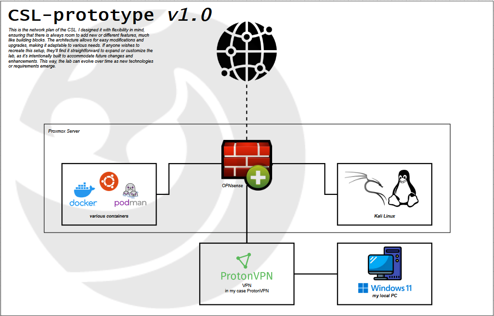

  

    <picture>
      <source media="(prefers-color-scheme: dark)" srcset="assets/images/stock/pantera-1.4.png">
      <source media="(prefers-color-scheme: light)" srcset="assets/images/stock/pantera-1.3.png">
      
    </picture>
  

   

  
  
  
  

 

# Overview
In this project, I will document the process of creating a **C**yber**s**ecurity **L**ab at home. The goal is to establish an environment protected from potential attacks or exploits that an external malicious user might try to take advantage of. I will be building this from scratch and will make sure to document every single step, as I believe this will help me reflect better when I want to update or change something. 
  
This is not a tutorial or guide, just a documentation of my work and progress, the way I approach it.
I want to mention that you don’t have to follow every step exactly as I did. I’ll be documenting everything, including some details that may not be strictly necessary.

 

> [!NOTE]
> It is possible that my documentation and project may contain some mistakes or errors. Therefore, some prior knowledge of the topic is necessary to ensure clarity and avoid confusion.

 

# Concept
Before starting, I created a prototype of the network plan using [Draw.io](https://app.diagrams.net/). The goal was to visualize my ideas and ensure that everything could be connected logically. I didn’t focus much on design, as I wanted to confirm the plan’s feasibility before refining its appearance.

These are some of the points I wanted to include in my Cybersecurity Lab:

- Containers
- Kali Linux
- Firewall / monitoring tools
- Private network for protection from external threats
  - IP configuration
  - Subnetting
  - Possible Testing Environment

 

| network plan - draw.io |
|:--------------------------------------------------:|
||

 

# What do you need?
Throughout this project, I will be adding to and adjusting my documentation as needed. For now, here are the essential components you'll need:
- [Proxmox](https://www.proxmox.com/en/)
- 

# Sources

- YouTube:  [Gerard O'Brien, Building the Ultimate Cybersecurity Lab](https://www.youtube.com/watch?v=XIvn0ZDSmKA&list=PL3ljjyal211AbTqlxSo6CGBiVqsXw8wrp&index=22)
- Medium:   [TheInfoSec Guy](https://medium.com/@jibingeorge.mg/cybersecurity-research-lab-setup-5beb54d8dd59)
- ChatGPT:  [OpenAI](https://chatgpt.com/)
- Friends

